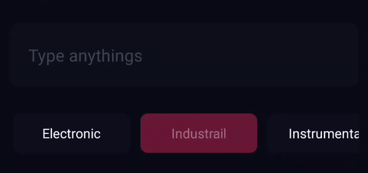

# RN-Search-Filter
<a href="https://www.npmjs.com/package/rn-search-filter"></a>
<br>

* `npm i rn-search-filter`

<br>




#### New Features

* Fork from <a href="https://github.com/parkerdan/rn-search-option-bar"></a>
* Fix problem `PropTypes`
* Add deactived button style `inactivebuttonStyle`
* Add deactived text style `inactivetextStyle`

#### How it works

* The first option shows as selected by default
* The `buttonStyle` `backgroundColor` will be applied to the selected option
* Unselected options are transparent background
* Unselected option's text gets the button's backgroundColor as it's color


```js
import React from 'react';

import { StyleSheet } from 'react-native';

const styles = StyleSheet.create({
  searchOptionBar:{
     height: 50,
     backgroundColor: colors.pageBackground,
     borderBottomColor: 'black',
     borderBottomWidth: StyleSheet.hairlineWidth
   },
   searchOptionButton: {
     width: 80,
     height: 30,
     borderRadius: 12,
     borderWidth: StyleSheet.hairlineWidth,
     borderColor: 'blue',
     backgroundColor: 'blue'
   },
   inactivesearchOptionButton:{
     height: 80,
     paddingTop:10,
     paddingLeft:7,
     paddingRight:10,
     paddingBottom:10,
     marginTop: 10,
     backgroundColor: COLORS.secendery,
   },
   buttonText:{
     color:'white',
     fontSize:14
   },
   inactivebuttonText:{
      color:'white',
      fontSize:14
}
 })


import SearchOptionBar from 'rn-search-filter';

class SearchOptionBarExample extends React.Component {
  render(){
    return(
      <SearchOptionBar
        onPress={ (opt) => console.log(opt) }
        options={ ['Electronic','Industrail', 'Instrumental' ,'Techno'] }
        containerStyle={ styles.searchOptionBar }
        buttonStyle={ styles.searchOptionButton }
        textStyle={ styles.buttonText }
        inactivebuttonStyle={ styles.inactivesearchOptionButton }
        inactivetextStyle={ styles.inactivebuttonText }
      />    
    )
  };

}
```

### Props

| Prop | Type | Description | Required |
| ---  | ---  | ---         | ---      |
| options | Array of Strings | The options listed in the buttons | **YES** |
| onPress | function | the function called when the button is pressed, called with the string as the argument | **YES** |
| buttonStyle | object | styles applied to the buttons | **YES** must include `backgroundColor` |
| inactivebuttonStyle | object | styles applied to the inactive buttons | **YES** must include `backgroundColor` |
| containerStyle | object | styles applied to the container | **YES** |
| textStyle | object | styles for the text, `color` will only be applied to the selected option | **YES** must include `color` |
| inactivetextStyle | object | styles for the text, `color` will only be applied to the unselected option | **YES** must include `color` |
| showsHorizontalScrollIndicator | boolean | show the scroll indicator | no |
